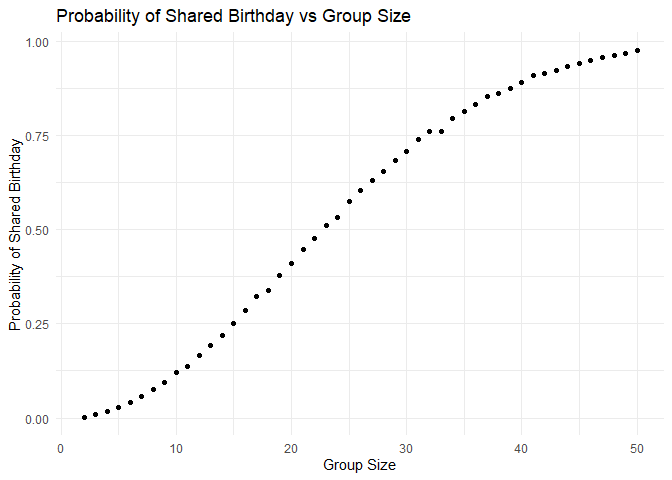
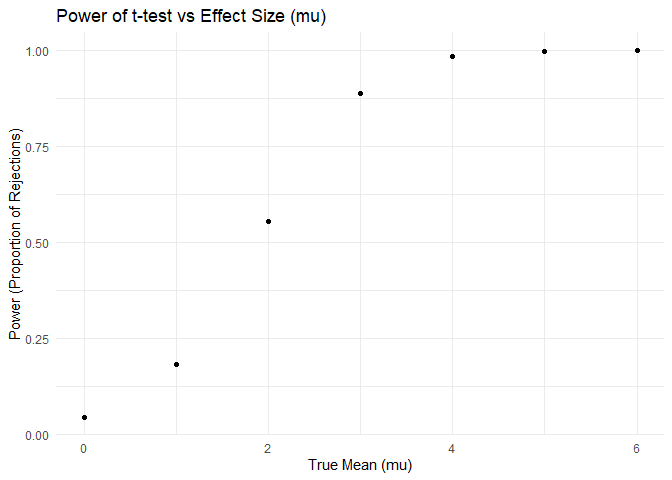
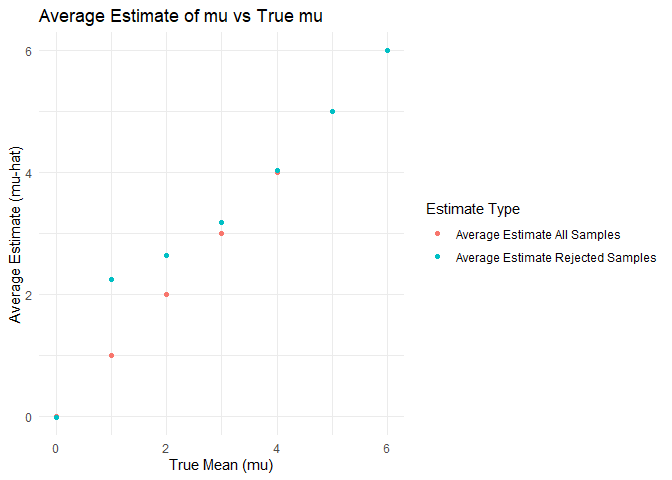
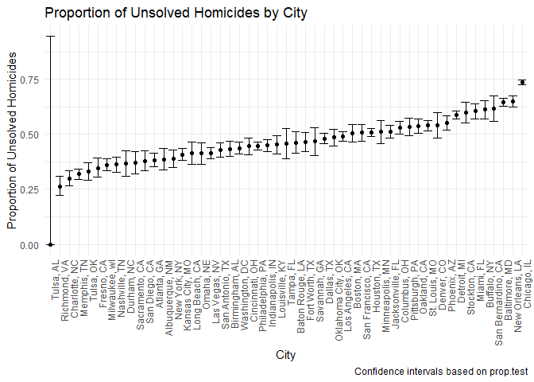

p8105_hw5_tz2659
================
Tianci Zhu

## Problem 1

``` r
set.seed(2024)

# Check if at least two people share a birthday in a group of n
dup_bday <- function(n) {
  bday <- sample(1:365, n, replace = TRUE)
  any(duplicated(bday))
}

simu <- 10000
size <- 2:50
results <- map_dbl(size, function(size) {
  mean(replicate(simu, dup_bday(size))) # Proportion of duplicates
})

combine <- tibble(group_size = size, probability = results)

ggplot(combine, aes(x = group_size, y = probability)) +
  geom_point() +
  labs(
    title = "Probability of Shared Birthday vs Group Size",
    x = "Group Size",
    y = "Probability of Shared Birthday"
  ) +
  theme_minimal()
```

<!-- -->

## Problem 2

``` r
set.seed(2024)

n <- 30
sd <- 5
mu <- 0:6
simu <- 5000
alpha <- 0.05

# Function to run simulation for mu
simu_power <- function(mu) {
  results <- replicate(simu, {
    sample <- rnorm(n, mean = mu, sd = sd)
    t <- t.test(sample, mu = 0) # One-sample t-test
    p <- tidy(t)$p.value
    p < alpha
  })
  mean(results)
}

power_results <- tibble(
  mu = mu,
  power = map_dbl(mu, simu_power)
)

ggplot(power_results, aes(x = mu, y = power)) +
  geom_point() +  
  labs(
    title = "Power of t-test vs Effect Size (mu)",
    x = "True Mean (mu)",
    y = "Power (Proportion of Rejections)"
  ) +
  theme_minimal()
```

<!-- -->

As mu increases, the power (proportion of rejections) also rises,
reaching nearly 1 for larger mu values. Larger effect sizes lead to
higher power, making it easier to detect true effects.

``` r
set.seed(2024)
n <- 30
sd <- 5
mu <- 0:6
simu <- 5000
alpha <- 0.05

# Function to run simulation and collect estimates
simu_mu <- function(mu) {
  results <- replicate(simu, {
    sample <- rnorm(n, mean = mu, sd = sd)
    t <- t.test(sample, mu = 0) # One-sample t-test
    result <- tidy(t)
    tibble(
      estimate = result$estimate,
      p = result$p.value
    )
  }, simplify = FALSE)
  
  results_df <- bind_rows(results)
  
  # Average estimate for all samples and rejected samples
  tibble(
    mu = mu,
    avg_all = mean(results_df$estimate),
    avg_rej = mean(results_df$estimate[results_df$p < alpha], na.rm = TRUE)
  )
}
mu_estimates <- map_dfr(mu, simu_mu)

ggplot(mu_estimates, aes(x = mu)) +
  geom_point(aes(y = avg_all, color = "Average Estimate All Samples")) +
  geom_point(aes(y = avg_rej, color = "Average Estimate Rejected Samples")) +
  labs(
    title = "Average Estimate of mu vs True mu",
    x = "True Mean (mu)",
    y = "Average Estimate (mu-hat)",
    color = "Estimate Type"
  ) +
  theme_minimal()
```

<!-- -->

The average estimate of mu across all samples aligns well with the true
mu, showing no bias. However, in samples where the null was rejected,
the average estimate is higher than the true mu for smaller effect
sizes. So the t-test’s power increases with effect size, and estimates
based only on rejected samples can be biased, particularly for smaller
effects.

## Problem 3

``` r
df <- read_csv("D:/rdata/homicide-data.csv", na = c("NA", "Unknown", "")) |>
  janitor::clean_names()|>
  mutate(city_state = paste(city, state, sep = ", "))
```

    ## Rows: 52179 Columns: 12
    ## ── Column specification ────────────────────────────────────────────────────────
    ## Delimiter: ","
    ## chr (8): uid, victim_last, victim_first, victim_race, victim_sex, city, stat...
    ## dbl (4): reported_date, victim_age, lat, lon
    ## 
    ## ℹ Use `spec()` to retrieve the full column specification for this data.
    ## ℹ Specify the column types or set `show_col_types = FALSE` to quiet this message.

``` r
city_summary <- df |>
  group_by(city_state) |>
  summarize(
    total_homicides = n(),
    unsolved_homicides = sum(disposition %in% c("Closed without arrest", "Open/No arrest"))
  )

# prop.test
city_results <- city_summary |>
  mutate(
    prop_test = map2(
      unsolved_homicides,
      total_homicides,
      ~ prop.test(x = .x, n = .y, conf.level = 0.95) |> tidy()
    )
  ) |>
  unnest(prop_test)
```

    ## Warning: There was 1 warning in `mutate()`.
    ## ℹ In argument: `prop_test = map2(...)`.
    ## Caused by warning in `prop.test()`:
    ## ! Chi-squared approximation may be incorrect

``` r
# Reorder cities based on proportion of unsolved homicides
city_results <- city_results |>
  mutate(city_state = fct_reorder(city_state, estimate))

ggplot(city_results, aes(x = city_state, y = estimate)) +
  geom_point() +
  geom_errorbar(aes(ymin = conf.low, ymax = conf.high)) +
  labs(
    title = "Proportion of Unsolved Homicides by City",
    x = "City",
    y = "Proportion of Unsolved Homicides",
    caption = "Confidence intervals based on prop.test"
  ) +
  theme_minimal() +
  theme(axis.text.x = element_text(angle = 90, hjust = 1))
```

<!-- -->
